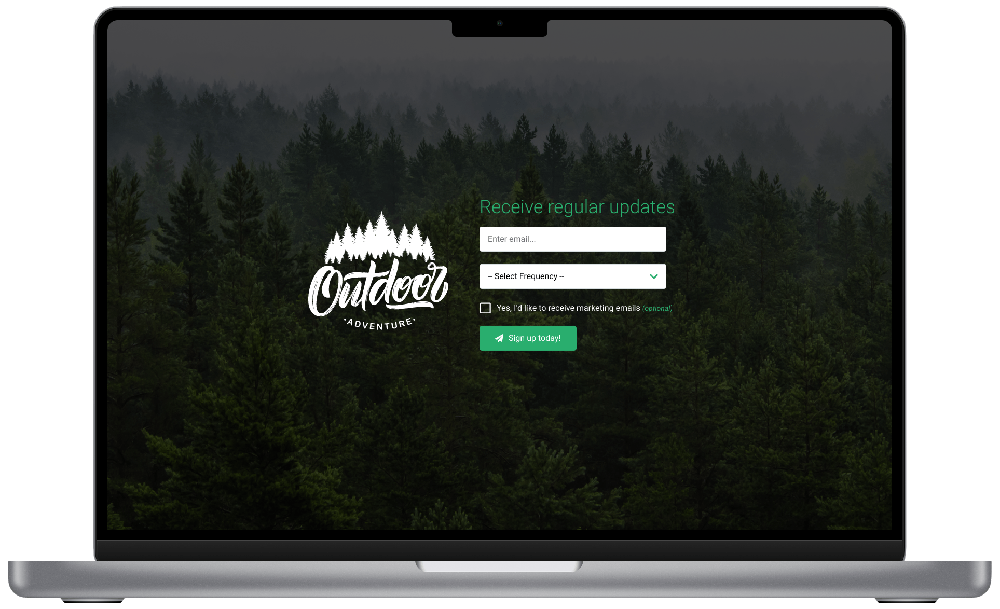

# Newsletter Signup Training Project

Build a simple newsletter signup splash page!

Building static pages like this isn't likely to be something we actually do for a real client, however, it's a great way to test your frontend basics while also introducing you to some general tools, methodologies and process that we use every day at Acro Media.

**Skills:** Git, HTML, CSS, Sass, JavaScript, Mobile-first, Image optimization, Accessibility, Figma, and more.

## Getting started

1. Clone this repo.
2. Move into the cloned project directory.
3. Run `npm install` to install the packages for compiling your stylesheets.
3. Create a working branch using your name (i.e. `git checkout -b mike-hubbard`).
4. Push your branch (i.e. `git push --set-upstream origin mike-hubbard`).
5. [Visit gitlab](https://git.acromedia.com/teams/ux/training/newsletter-signup/-/merge_requests) and create a new merge request.
6. Read through the [rest of the instructions on Confluence](https://acromedia.atlassian.net/wiki/spaces/UX/pages/425361409/FE+Training+1+-+Newsletter+Signup).

